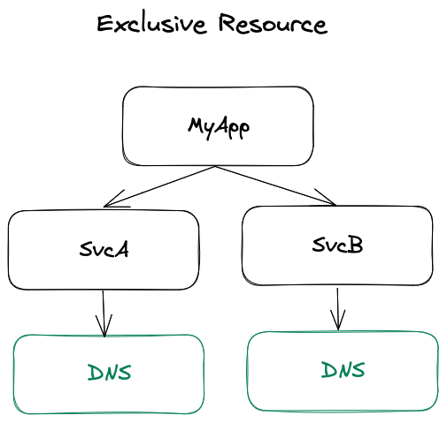
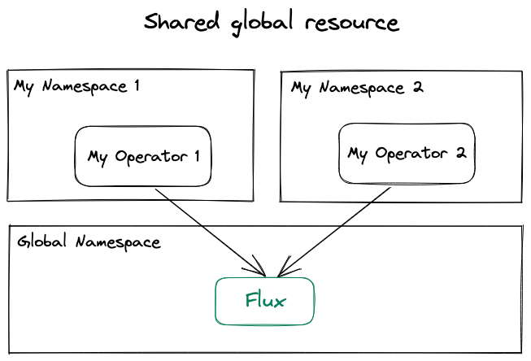
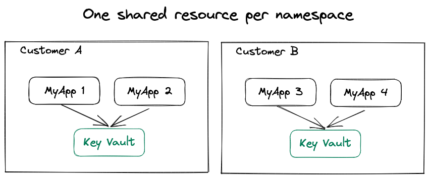
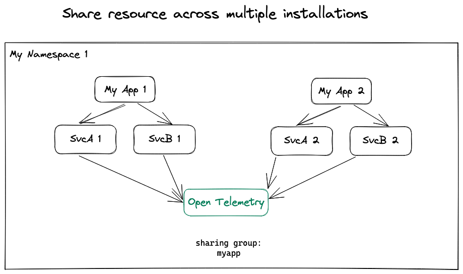

* [Abstract](#abstract)
* [Motivation](#motivation)
* [Rationale](#rationale)
* [Specification](#specification)
* [Implementation](#implementation)
* [Backwards Compatibility](#backwards-compatibility)
* [Security Implications](#security-implications)
* [Rejected Ideas](#rejected-ideas)
* [Open Questions](#open-questions)

## Abstract

Support advanced dependency use cases, such as shared dependencies, re-using existing installations to satisfy a dependency, and allowing any bundle to be used as a dependency as long as it satisfies the dependency's interface.

___

## Motivation

Initial Proposal: https://github.com/getporter/porter/discussions/1441

When we initially implemented dependencies in Porter, we knew that there were a lot of different directions that we could take but we were missing strong use cases and experience with what a dependency looked it and behaved with bundles.
We implemented the most obvious scenario (wordpress requires its own mysql database) and decided to wait for further feedback before continuing.

Now that we have been working with bundles for a while, more use cases have evolved:

* [Use Case: Sharing](#use-case-sharing)
  * [Unshared](#unshared)
  * [Shared](#shared)
  * [Prefer Local](#prefer-local)
  * [Shared within a Namespace](#shared-within-a-namespace)
  * [Shared by a Group of Installations](#shared-by-a-group-of-installations)
* [Use Case: Unmanaged Resource](#use-case-unmanaged-resource)
* [Use Case: Bundle Interface](#use-case-bundle-interface)

### Use Case: Sharing

The bundle author should be able to share a dependency with other installations, allowing Porter to reuse an existing installation to satisfy a dependency of another bundle.

#### Unshared

> I need an exclusive instance of my dependency

When a bundle is run, new installations are created for its dependencies which can result in multiple instances of the same bundle within a dependency graph.
For example, the DNS bundle can make DNS changes, such as adding an CNAME record and the domain is a bundle parameter.
Each microservice has a dependency on the DNS bundle and uses it to create a unique record for the microservice, such as mysvc-a.example.com and mysvc-b.example.com and in this case we explicitly do not want Porter to attempt to share this dependency between the two microservices bundles.



#### Shared

> I need a single instance of a resource shared with any installation that needs it

My custom Kubernetes operator depends upon having Flux installed on the cluster.
If is already present, reuse it.



#### Prefer Local

A namespace may have its own installation of a bundle that is also installed globally.
When a bundle can satisfy its dependency with both a global and local installation, Porter selects the local installation because it may have special customizations specific to the local namespace.

For example, there may be a global open telemetry collector available to all namespaces as a default configured with minimal sampling and logging, and also a namespace dedicated for developer testing with its own instance of open telemetry which is optimized for more extensive logging and debugging.
Any bundles installed in the developer namespace should select the instance of open telemetry that was specifically configured for troubleshooting this environment.


ℹ️ "Global" is defined as any bundle run by this instance of Porter, i.e. contained in Porter's database, can use the installation to satisfy a dependency.

#### Shared within a Namespace

> I need one secret vault per namespace

One organizational method for using Porter namespaces is having the namespace represent different environments.
For example, creating a namespace for each production region or customer.
Within each namespace there should only be a single instance of a key/value store containing secrets and they should not be shared across namespaces.



#### Shared by a Group of Installations

> My micro-services share a common dependency

My application has 2 micro-services and a shared postgres database.
When I install the first service, a database should be created for it.
When I install the other services, I want to share the database (and the connection string) between them.
If I install the bundle twice within the same namespace, for example to have two different versions installed side-by-side for A/B testing or proxying older versions of the API, each installation of the bundle should have its own separate postgres database because it could have different schemas.


My application has a shared open telemetry collector that doesn't change when different versions of my application is deployed.



### Use Case: Unmanaged Resources

> I already installed the dependency previously without using Porter

I already have SQL Server installed and I want to use it with Porter.
For example, a manually set up on-premise shared database server, a 64 core beast that I keep in the office closet.
I want to automatically inject the connection string for the database into other bundles that need a database.

It's important to acknowledge that many resources were provisioned before Porter was adopted and that Porter should require that it's the only tool managing deployments.
Porter should play nice and be able to adapt to environments where multiple tools are used to manage deployments without creating silos.

### Use Case: Bundle Interfaces

> My bundle requires a resource that can be satisfied by any bundle that expose the desired interface

Consider the many different ways that the MySQL database can be installed and used.
It could be installed on your local cluster using Helm. You may have a local server running on your desktop. It could be installed on a virtual machine on your cloud provider. Every cloud provider offers a managed MySQL service. All of these databases have something in common: a specific supported MySQL version and a connection string.

I can depend on any bundle that provisions a specific version of MySQL and outputs the connection string, without having to take a hard dependency on a specific implementation.

___

## Rationale

Bundle dependencies aren't exactly the same problem space as with software library or OS package dependencies.
The difference when dealing with instances of installed software is the added concept of ownership and allowing multiple instances of the bundle to be installed at the same time.
A bundle dependency needs to be able to express not only the name and version of the dependency but how the instance of that dependency's software may (or may not) be shared.

The resulting design you see in this proposal is a composite of traditional dependency management and Kubernetes' method of referencing resources using namespaces and label selectors.
Namespaces provide scope, allowing multiple instances of software to exist side-by-side, and label selectors give us a flexible language for declaring how to identify those instances when you may not have created them yourself.

___

## Specification

* [porter.yaml](#porter-yaml)
* [bundle.json](#bundle-juson)
* [Bundle Interfaces](#bundle-interfaces)
* [Wiring Dependencies](#wiring-dependencies)
* [Dependency Resolution](#dependency-resolution)
* [Use Case Solutions](#use-case-solutions)

The heart of the solution for all of the above use cases is reducing them to a single decision: "GetOrCreate".
The bundle declares a set of criteria that is used to identify an existing installation that satisfies the dependency.
If one cannot be resolved, then a new installation is created.

### porter.yaml

Below is the proposed dependencies section format:

```yaml
dependencies:
  # unordered list of bundles that this bundle depends upon
  requires:
    # A name or alias for the dependency throughout porter.yaml
    - name: DEPENDENCY_NAME
      # Criteria for using a bundle for the dependency
      bundle:
        # A full bundle reference that can be used as the default implementation of the bundle
        reference: FULL_BUNDLE_REFERENCE
        # Criteria for the bundle version used
        # Use vX.Y.Z-0 to allow prerelease versions to be resolved by Porter
        version: SEMVER_RANGE # See https://github.com/Masterminds/semver (v3 format)
        # An interface defining how the dependency will be used by this bundle
        # Porter always infers a base interface based on how the dependency is used in porter.yaml
        interface:
          # The URI of the interface, usually a well-known name but not necessarily
          # For example, https://getporter.org/interfaces/
          id: INTERFACE_URI
          # Specifies a bundle to use as the interface on top of how the bundle is used.
          reference: FULL_BUNDLE_REFERENCE
          # Specifies additional constraints that should be added to the bundle interface. Either bundle or reference may be specified but not both.
          # By default porter only requires the name and the type to match, additional jsonschema values can be specified to restrict matching bundles even further.
          # In the CNAB spec, you can embed an entire bundle.json document under "document". In Porter, we only support parameters, credentials and outputs, and they must be specified using Porter's syntax.
          document:
            parameters:
              - name: PARAMETER_NAME
                # TODO: Determine what to surface from jsonschema beyond type and $id
                type: PARAMETER_TYPE
                # When an $id is specified, the dependency must use the same $id value for the parameter/credential/output and the name does not have to match the name declared on the interface. Allows a bundle to implement an interface with different naming conventions.
                $id: URI
            credentials:
              - name: CREDENTIAL_NAME
                type: CREDENTIAL_TYPE
                $id: URI
            outputs:
              - name: OUTPUT_NAME
                $id: URI
      # Pass data from the current bundle to a dependency's credentials
      credentials:
        # The value can be hard-coded or a templated value, such as ${bundle.credentials.NAME}
        # The key is the name of a credential defined on the dependency
        DEPENDENCY_CREDENTIAL_NAME: CREDENTIAL_VALUE
      # Pass data from the current bundle to a dependency's parameters
      parameters:
        # The value can be hard-coded or a templated value, such as ${bundle.parameters.NAME}
        DEPENDENCY_PARAMETER_NAME: PARAMETER_VALUE
      # Set a bundle output using results of the dependency 
      outputs:
        # The value can be hard-coded or a templated expression, such as https://${outputs.host}:${outputs.port}
        # This introduces a new template variable, outputs, that contains the outputs of the current dependency
        # This was introduced to avoid bugs by having authors use ${bundle.dependencies.DEP.outputs.NAME} (which is also valid)
        BUNDLE_OUTPUT_NAME: OUTPUT_VALUE
      # Defines how this dependency may be shared with other bundles/installations.
      sharing:
        # The sharing mode which determines if the dependency may be shared and with whom.
        # - none: Do not share this dependency with other bundles.
        # - group: Share the dependency with other bundles in the same sharing group.
        mode: none | group
        # OPTIONAL. The name of the sharing group, any bundle in the group can share the dependency.
        # The group name defaults to an empty string, which is considered a valid group, allowing installations to be reused by default.
        #
        # You can use templating to make this value unique or dynamic.
        # For example, to only allow other bundles that were installed with this bundle to reuse the dependency, you can use the root installation's id with ${ installation.root.ID }. The root installation is the installation that was requested to be installed first, and is the root node in the dependency graph. If you originally ran the command `porter install wordpress`, wordpress is the root installation.
        group:
          name: GROUP_NAME
```


### bundle.json

Porter represents its bundle dependencies in the `org.getporter.dependencies@v2` custom CNAB extension.
If CNAB is interested in having this implementation of dependencies in the spec, we would collaborate on how it should look when translated to CNAB (for example, we use templates which CNAB doesn't support) and use the CNAB domain with a new extension.
Porter could then support both extensions, and bundles could opt-into a newer version of the dependencies extension by rebuilding the bundle.

Below is an example of how porter.yaml is converted to bundle.json.
Remember that after a bundle is built, Porter always uses the bundle.json to interact with the bundle.
Even "porter only" features, must be encoded in the bundle.json as custom extensions.

**porter.yaml**
```yaml
dependencies:
  requires:
    - name: infra
      bundle:
        reference: "localhost:5000/myinfra:v0.1.0"
      sharing:
        mode: group
        group:
          name: myapp
      credentials:
        token: ${bundle.credentials.token}
      parameters:
        database: myenvdb
        logLevel: ${bundle.parameters.logLevel}
    - name: app
      bundle:
        reference: "localhost:5000/myapp:v1.2.3"
      sharing:
        mode: group
        group:
          name: myapp
      credentials:
        db-connstr: ${bundle.dependencies.infra.outputs.mysql-connstr}
      parameters:
        logLevel: ${bundle.parameters.logLevel}
      outputs:
        endpoint: "https://${bundle.dependencies.infra.outputs.ip}:${outputs.port}/myapp"
```

**bundle.json**
```json
{
  "org.getporter.dependencies@v2": {
    "requires": {
      "app": {
        "bundle": "localhost:5000/myapp:v1.2.3",
        "sharing": {
          "mode": "group",
          "group": {
            "name": "myapp"
          }
        },
        "parameters": {
          "logLevel": "${bundle.parameters.logLevel}"
          }
        },
        "credentials": {
          "db-connstr": "${bundle.dependencies.infra.outputs.mysql-connstr}"
        },
        "outputs": {
          "endpoint": "https://${bundle.dependencies.infra.outputs.ip}:${outputs.port}/myapp"
        }
      },
      "infra": {
        "bundle": "localhost:5000/myinfra:v0.1.0",
        "sharing": {
          "mode": "group",
          "group": {
            "name": "myapp"
          }
        },
        "parameters": {
          "database": "myenvdb",
          "logLevel": "${bundle.parameters.logLevel}"
        },
        "credentials": {
          "token": "${bundle.credentials.token}"
        }
      }
    }
  }
}
```

#### Templates

Bundle authors can use template syntax when passing data between dependencies and the parent bundle.
This makes it easier to adapt bundles from other authors and reuse them in a bundle without having to write code to tweak inputs and outputs.
For example, a bundle may output a port and a host and another requires that those variables are combined into a single URI and with templates an author can alter the shape of the data passed between bundles to match what they expect.

Porter uses its template framework in the dependencies custom extension and the template must be rendered before the dependency graph can be resolved.
How template variables are used may create additional constraints on the dependency graph and affect the execution order.

The following template variables are supported in the dependencies extension:

* `bundle.*` such as bundle.version
* `installation.*` such as installation.root.id, which is used to provide a unique identifier for the dependency graph generated for the root installation
* `outputs.OUTPUT_NAME`. This is a new template variable that is only available when specifying how to promote outputs from a dependency to the parent bundle. It is the equivalent of bundle.dependencies.DEP.outputs.OUTPUT_NAME, and is provided because it is shorter and less error prone because the dependency key is based on the context of where it is used.

### Bundle Interfaces

Bundle interfaces are relevant when using a different bundle than what the dependency specified.
The interface is used to validate that a dependency can be used when:

* A version range is specified and Porter searches to use the highest allowed version.
* Porter searches for a compatible bundle to use, such as selecting an appropriate bundle based on the current platform or cloud provider.
* The user overrides the dependency manually.

A dependency's bundle interface is composed from:

* Outputs of the dependency that are used by the parent bundle.
* Outputs, credentials, and parameters defined in the dependency's interface.reference or interface.document fields.

The bundle author can choose to define a more restrictive bundle interface than what Porter can infer from how the dependency is used by providing a bundle.json document via interface.reference which is an OCI reference or interface.document which is an embedded sub-document in the dependency definition.
This document provides additional jsonschema for the parameters, credentials, and outputs.

#### Unmapped Credentials/Parameters

Specifically it is NOT composed from credentials and parameter mappings defined on the dependency.
Those mappings are _attempted_ by Porter and used when the resolved dependency has a matching credential/parameter, but they are not included in the bundle interface definition.
If a dependency defines a credential/parameter mapping and the resolved bundle doesn't define that credential/parameter, then the bundle can still be used to satisfy that dependency.
All credentials/parameters that are not mapped by the dependency are aggregated across entire dependency graph and these **unmapped credentials** or **unmapped parameters** are presented to the end-user to specify.
This allows Porter to resolve a dependency to a bundle with provider-specific credentials, such as an Azure service principal or Google service account, and require that the user provide the credentials and not the bundle author.

When a dependency defines a bundle interface, setting credentials/parameter mappings probably won't be very useful.
Explicit mappings are intended to assist bundle authors with using a bundle that is known at build time, ensuring that the bundles coordinate smoothly.
In short, the dependency's credentials and parameters fields are intended to be used only when bundle.reference is set, and not when just bundle.interface is set.

#### Well-known Identifiers

It's unrealistic to expect that every bundle will use the same consistent names for its parameters, credentials and outputs as other bundles that represent the same type of resource.
We can't expect all bundles that install MySQL for example to use connstr for its output connection string, or accept an incoming Kubernetes configuration file with the name kubeconfig.
To accommodate this, bundle authors may use well-known identifier to indicate what that parameter, credential or output represents.

When a bundle uses well-known identifiers, consuming bundles can rely on the identifier instead.
In the example below, the bundle declares a credential with a well-known identifier representing a kubeconfig with the cluster-admin role.
Then another bundle can more flexibly pass data to this bundle when it's used as a dependency because they both understand this identifier.

```yaml
# parent bundle
dependencies:
  requires:
    - name: cluster
      bundle:
        interface:
          credentials:
            - $id: "https://getporter.org/interfaces#kubernetes.config.cluster-admin"
```

```yaml
# resolved dependency bundle
credentials:
  - name: admin-kubeconfig
    $id: "https://getporter.org/interfaces#kubernetes.config.cluster-admin"
```

Porter uses the identifier instead of the credential name to determine if the dependency matches the bundle interface.
This allows a bundle to refer to the output connection string as "connstr", while some bundles defined the output as "connection-string" and others as "dbConn", etc.

Porter (or CNAB) can help maintain a set of well-known identifiers and explain what it represents so that other authors can use them.
Bundle authors who are interested in having the widest base possible of users will be motivated to apply the identifier so that their bundle can be used across platforms.

### Installation Interfaces

This is a subset of the bundle interface that is relevant to reusing an existing installation to satisfy a dependency.

### Installation Resource

The installation resource needs additional fields to store metadata that Porter can use to determine if an installation can satisfy another bundle's dependency.

When an installation is created to represent a dependency, the sharing mode and group should be copied from the bundle definition to the installation so that we can quickly query for suitable candidates without evaluating every bundle definition of every installation.
The sharing mode can be edited by the user, to allow for "break glass" situations that may arise where the user needs to accomplish something we didn't anticipate.
The other fields on status are also used for querying, such as interfaceDigest and provides, but do not allow user editing because they are simply a cache of bits of data from the bundle definition to assist with querying and cannot be changed without modifying the bundle definition associated with the installation.

When an installation has a sharing mode of none, Porter will not use it to satisfy a dependency for another bundle.

```yaml
schemaType: Installation
name: redis
# This should be copied from the bundle's dependency definition
sharing:
  mode: group
  group:
    name: my-application-group
status:
  # sharing contains information used when Porter queries the database for potential installations that can satisfy a dependency
  # If the installation seems compatible, the information is verified before being used to avoid stale data causing mis-matches.
  # Any time the installation is updated, these values should be refreshed using the latest bundle definition.
  # TODO(PEP003): Maybe don't name this sharing as well. It's just stuff we've cached from the bundle definition for querying.
  sharing:
    # The interface digest is a sha256 digest of the installation interface, generated from the current bundle definition.
    interfaceDigest: "sha256:abc12"
    # The well-known bundle interface(s) that the installation's bundle declares.
    provides:
      interface:
        name: https://getporter.org/interfaces#redis-7
```


### Wiring Dependencies

Dependencies defined in a bundle can be "wired" up to the parent bundle or other dependencies parameters, credentials, and outputs.
Following the CNAB Dependencies spec, the dependencies of a bundle do not "leak" into the parent bundle's interface.
So if a bundle depends upon another bundle that requires a credential, it is the responsibility of the parent bundle to set the dependency's credential, possibly by defining a credential on the parent bundle and then passing the credential to the dependency.
When a user interacts with a bundle, they are only prompted to fill in credentials/parameters for the root bundle and any [unmapped credentials/parameters](#unmapped-credentialsparameters) from dynamically resolved dependencies.

Below are some examples of how this wiring can look:

The parent bundle's kubeconfig credential is passed to the redis dependency's kubeconfig credential.

```yaml
credentials:
- name: kubeconfig

dependencies:
  requires:
    - name: redis
      bundle:
        reference: getporter/redis:v1.0.0
      credentials:
        kubeconfig: ${ bundle.credentials.kubeconfig }
```

The mysql dependency's connection-string output is passed to the myapp dependency's connstr parameter.
This indicates to Porter that the mysql dependency should be executed before the myapp dependency.

```yaml
dependencies:
  requires:
    - name: myapp
      bundle:
        reference: getporter/myapp:v1.0.0
      parameters:
        connstr: ${ bundle.dependencies.mysql.outputs.connection-string }
    - name: mysql
      bundle:
        reference: getporter/mysql:v5.7.13
```

* An output of a dependency can be passed to a credential of another dependency.
* An output of a dependency be used as the output value of the parent bundle's output.

### Dependency Resolution

Below is the precedence in which a dependency is resolved to a bundle or existing installation:

1. Bundle references or existing installations provided by the end-user.
1. Existing installations that match the installation criteria.
  * Namespaced installations are preferred over global installations. Installations from different namespaces are not considered.
  * Installations must be in the same sharing group when sharing.mode is group.
1. The highest version of the dependency's reference bundle that matches the defined version constraints.
1. The reference specified on the dependency (the default implementation).

 Searching for bundles that implement a bundle interface from a search space, such as a registry, is out-of-scope for this proposal and will be addressed in a forthcoming proposal for provider independent bundles.

🚫 After Porter resolves every dependency in the graph, it generates an execution plan that specifies the order that the bundles must be executed.

When an output from a dependency is set as a source to another dependency parameter or credential, that creates an additional constraint on the dependency graph.
The resulting execution plan should include not only the order of the bundles but how the parameters, credentials and outputs are wired.
If an execution plan can be generated, then the entire bundle graph should be executable without failing mid-run because the source of a parameter or credential cannot be determined, or relies up on a bundle that has not been executed yet.

### Use Case Solutions

For each use case outlined above, how can we use solve the original use cases?

* Sharing
  * [Unshared](#solution-unshared)
  * [Shared](#solution-shared)
  * [Prefer Local](#solution-prefer-local)
  * [Shared within a Namespace](#solution-shared-within-a-namespace)
  * [Shared by a Group of Installations](#solution-shared-by-a-group-of-installations)
* [Unmanaged Resource](#solution-unmanaged-resource)
* [Bundle Interface](#solution-bundle-interface)

#### Solution: Unshared

Example:
> Each microservice has a dependency on the DNS bundle and uses it to create a unique record for the microservice

Porter creates an instance of the dependency for each unique definition of the dependency, taking into account not only the bundle and its interface but also the other fields on the dependency such as parameters, credentials, and installation.

In the porter.yaml below, when each service defines a dependency on the DNS bundle, if each passes a different set of parameters to the bundle, such as a unique CNAME value to have the bundle create, then Porter will automatically result in separate instances of the DNS bundle in the graph.
Depending on the template variables used to define the dependency, Porter may not be able to determine if the dependency can be shared and will instead create separate instances.

```yaml
# mysvc-a porter.yaml
dependencies:
  requires:
    - name: dns
      bundle: example.com/dns-bundle:v1.2.3
      parameters:
        cname: mysvc-a

# mysvc-b porter.yaml
dependencies:
  requires:
    - name: dns
      bundle: example.com/dns-bundle:v1.2.3
      parameters:
        cname: mysvc-b
```

The above example doesn't explicitly configure sharing, and allows for the resulting DNS installation to be reused by another installation at a later time.
To completely prevent sharing, set sharing.mode to none (below):

Example: 
> an application requires a dedicated redis cache per installation

The dependency below will create a new installation for its redis dependency.
Porter will not attempt to reuse an existing installation or share this dependency with other bundles in the same dependency graph because the sharing mode is none.

```yaml
dependencies:
  requires:
    - name: redis
      bundle:
        reference: getporter/redis:v1.0.2
      sharing:
        mode: none # Do not share the dependency
```


#### Solution: Shared

Example:
> My custom Kubernetes operator depends upon having Flux installed on the cluster.
> If is already present, reuse it.

The dependency below will first try to reuse an installation of getporter/flux:v2.x in the current namespace, and if not present, look for a global installation.
Otherwise, it will install getporter/flux:v2.1.3 in the current namespace.

```yaml
dependencies:
  requires:
  - name: flux
    bundle:
      reference: getporter/flux:v2.1.3
      version: 2.x
    # Dependencies are available to be shared with other installations by default.
    # Below is how to configure that explicitly.
    # sharing:
    #   mode: group
    #   group:
    #     name: ""
```

#### Solution: Prefer Local

Example:
> My application has 2 micro-services and a shared postgres database.
> When I install the first service, a database should be created for it.
> When I install the other services, I want to share the database (and the connection string) between them.

The dependency below will reuse an installation of getporter/postgres:v2.x in the installation namespace only if it has the app=my-application label.
Otherwise, it will install getporter/postgres:v2.3.4 in the installation namespace.

```yaml
dependencies:
  requires:
  - name: postgres
    bundle:
      reference: getporter/postgres:v2.3.4
      version: 2.x
    sharing:
      mode: group
      group:
        name: my-application
```

#### Solution: Shared within a Namespace

> I need one secret vault per namespace

The dependency below uses the installation namespace to create a unique sharing group per namespace, allowing any installation in the namespace to share its key vault dependency.

```yaml
dependencies:
  requires:
  - name: keyvault
    bundle:
      reference: getporter/keyvault:v1.2.3
    sharing:
      mode: group
      group:
        name: ${ installation.Namespace }
```

#### Solution: Shared by a Group of Installations

> My micro-services share a common dependency

The dependency below uses a hard-coded group value of "myapp" to share its open telemetry dependency with any other installation that uses the same sharing group.

```yaml
dependencies:
  requires:
  - name: otel
    bundle:
      reference: getporter/otel:v1.2.3
    sharing:
      mode: group
      group:
        name: myapp
```

#### Solution: Unmanaged Resource

Example:
> I want Porter to automatically reuse existing infrastructure that I deployed outside of Porter.

For existing infra, define a bundle that just exposes the connection string via an output.
The bundle itself doesn't manage any resources.
When the bundle is installed, Porter remembers the provided connection string and can provide it to any installation that uses it as a dependency.

```yaml
name: shared-dev-sql-server

parameters:
- name: connection-string
  type: string
  path: /cnab/app/outputs/connection-string

outputs:
- name: connection-string
  type: string
  $id: "azure-sql-server-connection-string"
  path: /cnab/app/outputs/connection-string
```

The dependency below will reuse any installation that defines an output with the id "azure-sql-server-connection-string", regardless of the installation's bundle.
It maps the output found on the installation to the name "dbCon", allowing even bundles with different names for the output to be used.

```yaml
dependencies:
  requires:
  - name: sqlserver
    bundle:
      reference: azure/sqlserver:v1.2.68
      interface:
        outputs:
          - name: dbCon
            $id: "azure-sql-server-connection-string"

install:
- exec:
    description: "Install something that needs a connection string"
    commands: ./install.sh
    arguments:
    - ${ bundle.dependencies.sqlserver.outputs.dbCon }
```

Here is what it would look like for an administrator to register the existing server and then use it.

```console
$ porter install --reference shared-dev-sql-server:v0.1.0 -p connection-string=existing-connection-string
# registers the existing server with Porter

$ porter install --reference myapp:v1.0.0
# Porter automatically reuses the existing server to satisfy the dependency
```

🚫 Keeping an output in-sync with an external secret, i.e. getting the installation to always return the most recent value of a secret that is not managed by Porter, is out-of-scope of this proposal.
This is something that we could add later, or someone can mimic with creativity, so that when Porter retrieves the output of an installation, it resolves the secret from a different location than the output of the last run.

#### Solution: Bundle Interface

Example:
> I want my bundle to be able depend on a bundle that provisions a specific version of MySQL and outputs the connection string, without having to take a hard dependency on a specific implementation.

The dependency below 
```yaml
dependencies:
  requires:
  - name: mysql
    bundle:
      interface:
        outputs:
          - name: dbCon
            $id: "mysql-5.7-connection-string"

install:
- exec:
    description: "Install something that needs a connection string"
    commands: ./install.sh
    arguments:
    - ${ bundle.dependencies.sqlserver.outputs.dbCon }
```

When Porter installs the bundle, it first tries to reuse an existing installation that has an output with id "mysql-5.7-connection-string".
If an existing installation cannot be found, the bundle cannot be installed and the user is prompted to specify which bundle to use.
This allows an author to require a resource, without providing a default implementation, which can be difficult when writing a bundle that can be used in multiple platforms.

When matching existing installations against the bundle interface, only outputs are considered, even if the interface defines parameters and credentials as well.

## Implementation

All implementation work related to this PEP are labeled with `pep003-advanced-dependencies`.

* [Issues](https://github.com/getporter/porter/issues?q=is%3Aissue+label%3Apep003-advanced-dependencies)
* [Pull Requests](https://github.com/getporter/porter/pulls?q=is%3Apr+label%3Apep003-advanced-dependencies)

At a high level the work breaks down to:

* Define the dependencies in porter.yaml and in the bundle.json, including how to pass data between bundles.
* Resolve the dependencies for a bundle into a deep graph of bundles to execute or installations to reuse.
* Represent the bundles to execute as a [workflow](#workflow-resource), and the order in which they may be run.
* Update supporting commands to give users more insight into a bundle with dependencies.

---

## Backwards Compatibility

This is a new implementation of dependencies that is implemented side-by-side with the original implementation (v1).
The v2 implementation is a superset of the concepts of v1, anything in v1 can be represented in v2.
We are using a feature flag, `dependencies-v2`, while the feature is being worked on and users must opt into the functionality of v2.
The goal is that when v2 is ready, it will replace v1, and retain the same behavior for bundles that use the original extension.

In CNAB, dependencies v2 is defined in a new custom extension, `org.getporter.dependencies@v2`.
Later we can transition to an agreed upon extension in the CNAB namespace if the custom extension is adopted by CNAB.
At that point, Porter can support its own extension and the new CNAB extension at the same time.
Bundles that originally used Porter's custom extension can be rebuilt to switch to the CNAB dependencies extension.

___

## Security Implications

* Reusing outputs from existing installations

  This proposal allows you to reuse outputs from an existing installation.
  Porter does not have any ACLs on installation data, you either have access to the host environment or you don't.
  The way to isolate installation data from being accessed or reused by another installation is to use separate host environments.
  Users could do this previously through `porter installation outputs show OUTPUT --installation INSTALLATION` so it's not a new concern, just makes it easier.

___

## Rejected Ideas

N/A

---

## Open Questions

### How can we use an interface when implementations have different credentials?

A. It is very likely that for bundles that implement a resource on different platforms that the credentials will not be the same between possible bundle implementations.
The google bundle will require different credentials than the azure bundle.
This isn't true for all resources, apps that deploy to kubernetes for example will only need a kubeconfig, regardless of the cluster vendor.

Credentials and parameters that do not have an explicit mapping in the dependency definition are considered "unmapped" and the end-user will see them in the explain output (the details of this will be explored further in a "providers" proposal).

### Do we still want to use an array for the dependencies?

Q. The current format uses an array to create an explicit ordering of the dependencies.
Now that Porter resolves its own ordering, should we stick with the array to be consistent with how we define other things, like parameters, or should we use a map to reinforce that the ordering is not based on the order of the dependencies in the array?

A. For consistency and better autocomplete experience, we will stick with an array.

### Do we want to use template syntax for dependency wiring?

Q. Should we use the template delimiters for the dependency wiring, e.g. `${bundle.dependencies.mysql.output.connstr}`, to be consistent with how we access that data elsewhere in the bundle or should we use a different format to make it clear that it can't be composed like the templates can?

A. We've vetted using template syntax in a few places in dependency definitions and have verified that it's possible, and that we can support more than single variable injection. So yes, we will continue to be consistent and use the same template syntax.

### How does bundle interfaces and version ranges mix with the concept of immutable bundles?

Q. Since a dependency can be resolved to more recent version that what was specified when the bundle was built, how do this reconcile with the claim that bundles are immutable.

A. Bundle authors continue to be responsible for making their bundle immutable (or not).
A bundle has always been able to either pin to specific resources/versions, or be more dynamic at runtime.
Authors can choose to pin to a specific dependency version, or allow for whatever they expect will work (such as newer versions of a mysql bundle).
End-users can also control the versions selected when porter installs a bundle with dependencies, and we could add configuration to always select the default implementation, or they can create an explicit workflow and reuse it to get the same dependency graph.

### Which domain to use for well-known URIs?

Until dependencies v2 is adopted in CNAB, we will use the getporter.org domain.
Once adopted, bundle authors can opt-into using the CNAB domain by updating their bundle definition.

[PEP005]: https://github.com/getporter/proposals/blob/main/pep/005-mixins-are-bundles.md
